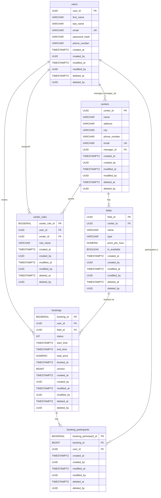

# ERD — Padelcenter Domain Schema

Esquema completo de base de datos generado a partir de las migraciones Flyway
`V1__init_schema.sql` y `V3__add_missing_indexes.sql`.

## Tablas

| Tabla | Clave primaria | Notas |
|---|---|---|
| `users` | `user_id` (UUID) | Soft delete. Email único. |
| `centers` | `center_id` (UUID) | `manager_id` → `users`. Soft delete. |
| `fields` | `field_id` (UUID) | FK `center_id` ON DELETE CASCADE. Nombre único por centro. |
| `bookings` | `booking_id` (BIGSERIAL) | FK `field_id` ON DELETE RESTRICT. Bloqueo optimista con `version`. |
| `booking_participants` | `booking_participant_id` (BIGSERIAL) | Junction entre `bookings` y `users`. |
| `center_roles` | `center_role_id` (BIGSERIAL) | Rol por centro: ADMIN, MANAGER, USER. Un registro por par (user, center). |

## Campos de auditoría (todas las tablas)

Todas las tablas comparten el mismo patrón de auditoría:

| Campo | Tipo | Descripción |
|---|---|---|
| `created_at` | `TIMESTAMPTZ NOT NULL DEFAULT now()` | Fecha de creación |
| `created_by` | `UUID` | UUID del usuario que creó el registro |
| `modified_at` | `TIMESTAMPTZ` | Fecha de última modificación |
| `modified_by` | `UUID` | UUID del usuario que modificó |
| `deleted_at` | `TIMESTAMPTZ` | Fecha de borrado lógico (null = activo) |
| `deleted_by` | `UUID` | UUID del usuario que borró |

## Diagrama

## Índices (V3)

| Índice | Tabla | Columna | Motivo |
|---|---|---|---|
| `idx_bookings_user_id` | `bookings` | `user_id` | Historial de reservas por usuario |
| `idx_bookings_field_id` | `bookings` | `field_id` | Reservas por pista |
| `idx_center_roles_user_id` | `center_roles` | `user_id` | Roles de un usuario |
| `idx_center_roles_center_id` | `center_roles` | `center_id` | Miembros de un centro |
| `idx_users_email` | `users` | `email` | Búsqueda por email (login, deduplicación) |

## Restricciones de integridad referencial

| FK | Comportamiento al borrar padre |
|---|---|
| `centers.manager_id → users.user_id` | SET NULL |
| `fields.center_id → centers.center_id` | CASCADE |
| `bookings.user_id → users.user_id` | CASCADE |
| `bookings.field_id → fields.field_id` | RESTRICT (no se puede borrar una pista con reservas activas) |
| `booking_participants.booking_id → bookings.booking_id` | CASCADE |
| `booking_participants.user_id → users.user_id` | CASCADE |
| `center_roles.user_id → users.user_id` | CASCADE |
| `center_roles.center_id → centers.center_id` | CASCADE |
